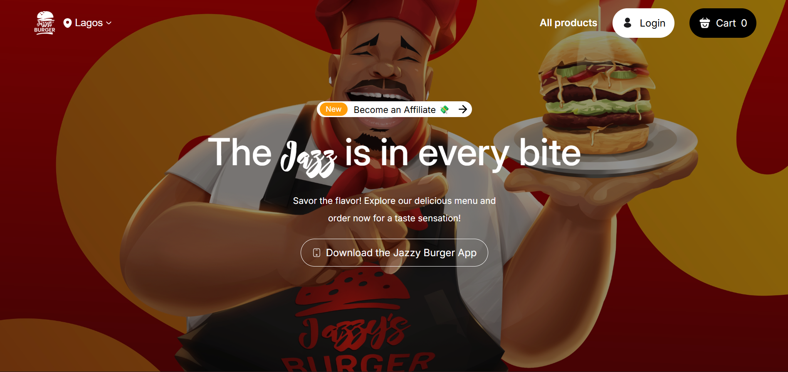

# Jazzy Burger Website Clone

A responsive restaurant website clone built with **HTML, CSS, and JavaScript**.
This project focuses on building a clean UI, dynamic product rendering, and a structured layout similar to a modern food ordering website.

## Project Overview

The Jazzy Burger Clone is a frontend project created to practice **component-based UI structure, DOM manipulation, and responsive layouts**. The goal of this project is to simulate the interface of a burger ordering website while improving real-world frontend development skills.

This project demonstrates how a menu-driven website can dynamically display products and allow users to browse items in a structured layout.

## Features

* Responsive burger product grid
* Dynamic rendering of burger items using JavaScript
* Category filtering system
* Product cards with images and pricing
* Cart review layout
* Clean and structured UI layout
* Mobile-friendly responsive design

## Technologies Used

* **HTML5** — semantic page structure
* **CSS3** — layout, styling, and responsive design
* **JavaScript (Vanilla JS)** — dynamic content rendering and interaction

## What I Practiced in This Project

* Structuring scalable HTML layouts
* Writing clean and maintainable CSS
* Using JavaScript to dynamically generate UI elements
* Organizing data using JavaScript objects/arrays
* Improving class naming and component structure
* Building responsive layouts for different screen sizes

## Author

**Timothy Korea**

Frontend developer focused on building clean, structured, and responsive web interfaces while continuously improving development skills.

## Preview

## Live Demo

[View Live Project](https://timothykorea.github.io/Jazzy-burger-clone/)